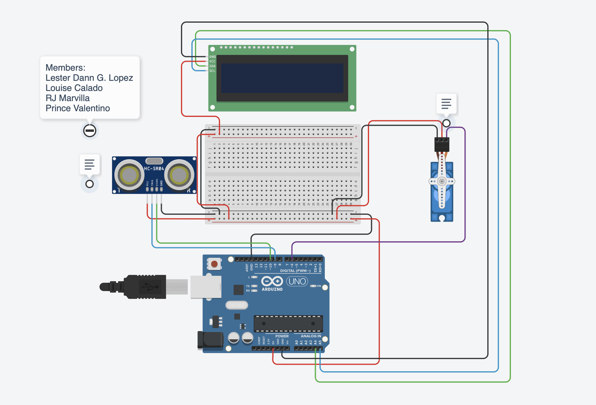

# 💧 Smart Water Dispenser (Arduino-Based)

---

### Microprocessor and Microcontroller Final Project:

#### Members:

* Lester Dann G. Lopez
* Louise Calado
* RJ Marvilla
* Prince Valentino

---

A simple and intelligent water dispenser system designed using Arduino, which dispenses water automatically when a cup is detected using an ultrasonic distance sensor. The dispensing mechanism is controlled via a servo motor that pulls a rope tied to the dispenser valve.

## 🚀 Project Overview

This project automates water dispensing to reduce spillage, enhance hygiene, and add convenience. It uses basic electronics components and can be expanded with features like volume control, mobile app integration, or water level monitoring.

## 📦 Components Used

* Arduino UNO (or compatible board)
* Ultrasonic Distance Sensor (HC-SR04)
* Servo Motor (e.g., SG90 or MG996R)
* Water dispenser container with a pull-to-open valve
* Rope or wire to connect servo to dispenser
* Breadboard and jumper wires
* Power supply or USB
* **16x2 I2C LCD Display**  <!-- new -->

## 🔧 How It Works

  

[Click to View Thinker Cad Sketch](https://www.tinkercad.com/things/0Vk9JMShGTC-smart-dispenser/editel?returnTo=https%3A%2F%2Fwww.tinkercad.com%2Fdashboard%2Fdesigns%2Fcircuits&sharecode=LvRLok9xnmrU1RAvZg5lUmCUmOO4Iy1SVve9DZk88KM)

---

1. **Cup Detection:**
   The ultrasonic sensor continuously measures the distance in front of the dispenser. When a cup comes within a predefined range, the system detects its presence.

2. **Water Dispensing Mechanism:**
   A servo motor is connected to a rope tied to the dispenser’s valve. When the cup is detected:

   * The servo rotates to a specific angle, pulling the rope.
   * This opens the water outlet and starts dispensing.

3. **LCD Feedback and Water Level Monitoring:**  <!-- new -->

   * A 16x2 I2C LCD displays messages to guide the user.
   * When the cup is detected, the display shows “Filling cup” and the remaining water volume in milliliters.
   * When no cup is detected, it prompts the user to “Insert cup.”
   * If the water supply is depleted, it displays “Out of water!”

4. **Stopping the Flow:**

   * After a short delay (enough to fill a standard cup), the servo returns to its original position, closing the valve.
   * A **safety timeout** is implemented to automatically stop dispensing if the cup is not removed or the servo fails to return, preventing overflow.

## ⚙️ Features

* **Automatic Cup Detection**
* **Servo-Based Valve Control**
* **Touchless and Hygienic Operation**
* **16x2 I2C LCD Display for Real-time Feedback and Water Level Monitoring**  <!-- new -->
* **Safety Timeout to Prevent Overflow**
* **Compact and Customizable Design**

## 🧠 Possible Extensions

* Water volume estimation based on timing
* Mobile app integration (e.g., via Bluetooth)
* Water level monitoring in the container with sensors
* Machine learning for adaptive dispensing behavior

## 🛠️ Future Improvements

* Support for different cup sizes
* Battery-powered or solar-powered version
* 3D printed casing for aesthetic appeal
* Voice-activated dispensing
